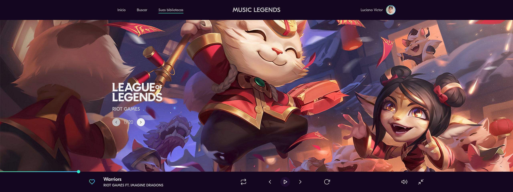

<h1 align="center"> Music Legends</h1>

  

## 💻 Projeto

O protótipo desse website foi desenvolvido pelo [**Iuri Silva**](https://www.iuricode.com/), [clique aqui](https://www.figma.com/file/Yb9IBH56g7T1hdIyZ3BMNO/Desafios---Codel%C3%A2ndia?node-id=80254%3A764) para abrir o protótipo no figma.

## 🚀 Tecnologias

- [x] HTML, SCSS, JS
- [x] SVG Images

## 🏁 Iniciar ambiente de desenvolvimento para VSCode

1. Abra a pasta do projeto no `VSCode`
2. Instale a extensão` Live Server` e `Live Sass Compiler`
3. Clique com o botão direito do mouse em `index.html` > `Abrir com o Live Server`
4. Acesse o **endereço gerado** no seu navegador foguete 🚀
